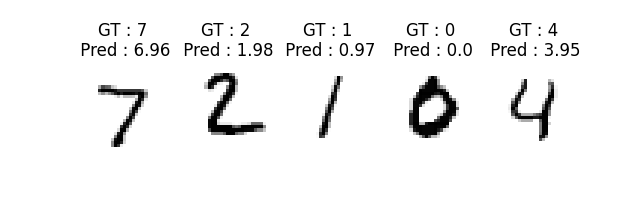

<br>

## MNIST image classification : **C**onvolutional **N**eural **N**etwork (**CNN**)

MNIST 데이터셋으로는 조금 이례적인 방법의 딥러닝 적용인데요, 저는 자주 사용하는 이미지로부터 **클래스**가 아닌 **값**을 예측하는 이미지 회귀 (**Image regression**)을 수행해 보겠습니다.

이미지 한 장으로부터 이미지가 0~9의 숫자 중 어느 것에 속하는지 **클래스를 구분하는 것이 아닌**

이미지 한 장으로부터 0.0, 1.0, ... 9.0 처럼 **값**을 예측하는 것입니다.

나중에 깃허브에 업로드 하겠지만, 이미지로부터 값을 예측하는 것은 굉장히 많은 분야에서 사용됩니다.

예를들면 이미지로부터 이 이미지가 어느 위치/방향에서 촬영되었는지 6DoF를 추정하는 `PoseNet (Alex Kendall)`등에서 말이죠.

<br>

---
**Network**

```python
class FCL_Regression(nn.Module):
    def __init__(self):
        super(FCL_Regression, self).__init__()
        self.fc1 = torch.nn.Linear(1 * 28 * 28, 500, bias=True)
        self.relu = torch.nn.ReLU()
        self.fc2 = torch.nn.Linear(500, 500, bias=True)
        self.fc3 = torch.nn.Linear(500, 10, bias=True)
        self.fc4 = torch.nn.Linear(10, 1, bias=True)

    def forward(self, x):
        x = torch.flatten(x, 1)
        x = self.relu(self.fc1(x))
        x = self.relu(self.fc2(x))
        x = self.relu(self.fc3(x))
        out = self.fc4(x)
        return out
```

네드워크는 기존의 `MLP`와 거의 동일하게 구성합니다.

다만 마지막 `fc4`에 이미지 클래스에 속할 확률 0~9까지의 10개가 아닌, 1개의 값을 예측할 것이므로 **1채널**로 바꿔줍니다.

<br>

---
**Training**

```python
criterion = nn.functional.l1_loss
```

학습에는 `l1_loss`를 사용합니다. $|x-x'|$을 손실함수로 사용하겠다는 뜻입니다.

```python
target = target.float()
output = torch.squeeze(output)
loss = criterion(output, target) # Loss 계산
```

학습시에도 이를 위한 작업을 해줍니다.

GT값이 분류시에는 이미지의 범주 ex) 2 였는데, 이를 float으로 전환해 2.0을 받아올 수 있도록 합니다.

<br>

---
**Inference**

```python
for ( ... )
    output = model(data) # Input data -> Network(Input) -> Output 획득
    pred = output.item()
    target = int(target.item())
    
    acc += (pred - float(target))**2

...

print(pth, ' : Accuracy', round((acc**0.5)/len(test_loader), 3))
```

추론시에는 예측값 (float)과 참값(범주의 float값)을 통해 RMSE를 계산할 수 있도록 합니다.



가시화 결과를 보면 GT와 비슷한 숫자 *값*을 예측하는 것을 볼 수 있습니다.

숫자 7이라는 이미지를 입력으로 주었을 때 7과 근사한 6.96이라는 수치를 예측했네요.


```
FIRST.pth  : Accuracy 0.053
MIDDLE.pth  : Accuracy 0.007
LAST.pth  : Accuracy 0.006
```


> Regression을 구현해본다! 에 의미를 두는 예제입니다!!! 실제로 분류 데이터인 MNIST로 수행하는 Regression은 의미가 없다고 봐도 무방!