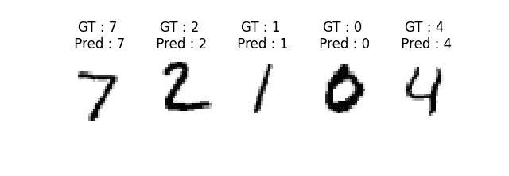

 

# 파이토치 간단 예제들

## [Gradient를 이용한 미분값 구하기](https://github.com/wooni-github/pytorch_tutorials/blob/main/3.SimpleExamples/3.1.Gradient/3.1.Gradient.md)
예제코드 [pytorch_tutorials/3.SimpleExamples/3.1.Gradient/Gradient.py](https://github.com/wooni-github/pytorch_tutorials/blob/main/3.SimpleExamples/3.1.Gradient/Gradient.py)

 

## [Linear regression](https://github.com/wooni-github/pytorch_tutorials/blob/main/3.SimpleExamples/3.2.LinearRegression/3.2.LinearRegression.md)
예제코드 $y = ax + b$ [pytorch_tutorials/3.SimpleExamples/3.2.LinearRegression/linear_regression1.py](https://github.com/wooni-github/pytorch_tutorials/blob/main/3.SimpleExamples/3.2.LinearRegression/linear_regression1.py)

예제코드 $y = ax^2 + bx + c$ [pytorch_tutorials/3.SimpleExamples/3.2.LinearRegression/linear_regression2.py](https://github.com/wooni-github/pytorch_tutorials/blob/main/3.SimpleExamples/3.2.LinearRegression/linear_regression2.py)

 

## [MNIST image classification : **M**ulti-**L**ayer **P**erceptron (**MLP**) ~ **F**ully **C**onnected **L**ayers (**FCL**)](https://github.com/wooni-github/pytorch_tutorials/blob/main/3.SimpleExamples/3.3.MNIST_MLP/3.3.MNIST_MLP.md)

MNIST 데이터셋 MLP를 이용한 분류 예제입니다.

[학습] 예제코드 [pytorch_tutorials/3.SimpleExamples/3.3.MNIST_MLP/MNIST_MLP_Train.py](https://github.com/wooni-github/pytorch_tutorials/blob/main/3.SimpleExamples/3.3.MNIST_MLP/MNIST_MLP_Train.py)

[추론] 예제코드 [pytorch_tutorials/3.SimpleExamples/3.3.MNIST_MLP/MNIST_MLP_Test.py](https://github.com/wooni-github/pytorch_tutorials/blob/main/3.SimpleExamples/3.3.MNIST_MLP/MNIST_MLP_Test.py)

## [MNIST image classification : **C**onvolutional **N**eural **N**etwork (**CNN**)](https://github.com/wooni-github/pytorch_tutorials/blob/main/3.SimpleExamples/3.4.MNIST_CNN/3.4.MNIST_CNN.md)

MNIST 데이터셋 CNN을 이용한 분류 예제입니다.

[학습] 예제코드 [pytorch_tutorials/3.SimpleExamples/3.4.MNIST_CNN/MNIST_CNN_Train.py](https://github.com/wooni-github/pytorch_tutorials/blob/main/3.SimpleExamples/3.4.MNIST_CNN/MNIST_CNN_Train.py)

[추론] 예제코드 [pytorch_tutorials/3.SimpleExamples/3.4.MNIST_CNN/MNIST_CNN_Test.py](https://github.com/wooni-github/pytorch_tutorials/blob/main/3.SimpleExamples/3.4.MNIST_CNN/MNIST_CNN_Test.py)

 

## [MNIST image regression](https://github.com/wooni-github/pytorch_tutorials/blob/main/3.SimpleExamples/3.5.MNIST_Regression/3.5.MNIST_Reg.md)

MNIST 데이터셋 MLP를 이용한 회귀 예제입니다.

[학습] 예제코드 [pytorch_tutorials/3.SimpleExamples/3.5.MNIST_Regression/MNIST_Reg_Train.py](https://github.com/wooni-github/pytorch_tutorials/blob/main/3.SimpleExamples/3.5.MNIST_Regression/MNIST_Reg_Train.py)

[추론] 예제코드 [pytorch_tutorials/3.SimpleExamples/3.5.MNIST_Regression/MNIST_Reg_Test.py](https://github.com/wooni-github/pytorch_tutorials/blob/main/3.SimpleExamples/3.5.MNIST_Regression/MNIST_Reg_Test.py)

