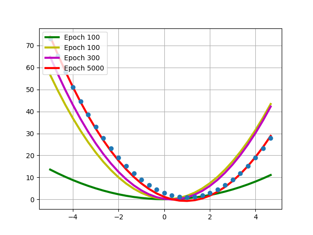

 

# Pretrained 네트워크를 이용한 추론

## [Gradient를 이용한 미분값 구하기](3.1.Gradient/)

 

## [Linear regression](3.2.LinearRegression/)
예제 $y = ax + b$ 

예제 $y = ax^2 + bx + c$ 

 

## [MNIST image classification : **M**ulti-**L**ayer **P**erceptron (**MLP**) ~ **F**ully **C**onnected **L**ayers (**FCL**)](3.3.MNIST_MLP/)

MNIST 데이터셋 MLP를 이용한 분류 예제입니다.

## [MNIST image classification : **C**onvolutional **N**eural **N**etwork (**CNN**)](3.4.MNIST_CNN/)

MNIST 데이터셋 CNN을 이용한 분류 예제입니다.

 

## [MNIST image regression](3.5.MNIST_Regression/)

MNIST 데이터셋 MLP를 이용한 회귀 예제입니다.

