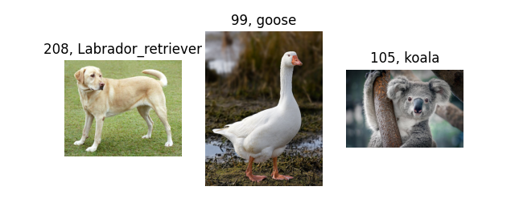

<br>

## Image classification : ImageNet dataset Inference

예제코드 [pytorch_tutorials/4.PretrainedNetworks/4.1.PretrainedClassification/pretrained_classification.py](https://github.com/wooni-github/pytorch_tutorials/blob/main/4.PretrainedNetworks/4.1.PretrainedClassification/pretrained_classification.py)

<br>

파이토치에서 기본적으로 제공하는 매우 강력한 기능이죠.

ImageNet의 대용량 데이터로 사전 학습을 진행해놓은 유명한 네트워크들의 학습 파라미터를 저장해놓은 값을 **코드 한 줄**로 가져올 수 있는 기능입니다.

예제에서는 대표적인 이미지 분류 네트워크인 **GoogLeNet, VGGNet, ResNet**을 이용해보겠습니다.

<br>

---
**Inference**

큰 틀에서 중요한 부분만 짚고 넘어가겠습니다.

```python
transform = transforms.Compose([
    transforms.Resize(256),
    transforms.CenterCrop(224),
    transforms.ToTensor(),
    transforms.Normalize(mean=[0.485, 0.456, 0.406], std=[0.229, 0.224, 0.225])])
```

(아마도 모든) 이미지넷 데이터셋에 학습을 진행한 네트워크들은, 위와 같은 transform을 적용하였습니다.

이미지를 `(256)`크기로 `Resize`하고, `(244)`크기로 `CenterCrop`한 후 (학습시에는 같은크기로 `RandomCrop`하기도 함)

`mean=[0.485, 0.456, 0.406], std=[0.229, 0.224, 0.225]`의 수치로 `Normalize`를 수행합니다.

당연하게도 외울 필요는 없이, 이런게 있었구나! 기억만 해두고 복사 붙여넣기를 이용합시다!

<br>

```python
model = models.googlenet(pretrained=True)
model.eval()
```

이후 모델을 불러와 `.eval`로 평가용으로 설정합니다.

내부의 `pretrained`파라미터를 `True`로 설정하지 않으면, 네트워크 구조만 가져오고 임의의 초기값으로 초기화 된 weights로 설정하게 됩니다.

<br>

```python
out = model(torch.unsqueeze(transform(img), 0))
_, index = torch.max(out, 1) #가장 확률이 높은 것 뽑아냄
```

추론시에는 앞선 [MNIST Classification 추론 예제](https://github.com/wooni-github/pytorch_tutorials/blob/main/3.SimpleExamples/3.3.MNIST_MLP/3.3.MNIST_MLP.md)처럼
`transform`한 이미지를 네트워크에 넣어 추론합니다.

이번 예제에서 `torch.unsqueeze`를 `0`번째 채널에 대해 수행한 이유는, 이미지 한 장이 [`H x W x C`]로 이루어져 있기 때문에 배치크기를 더한 [`B x H x W x C]`로 만들어주기 위함입니다.

추론된 결과는 `[B x class 수]` (ImageNet의 경우 1000) 로 반환되기에 `.max`메서드를 이용해 가장 높은 확률을 갖는 `index`를 뽑아냅니다.

<br>

```python
with open('imagenet_classes.txt') as f:
    classes = [line.strip() for line in f.readlines()]
classes = classes[4:] # .txt파일의 최초 4줄은 의미 없음
```

당연하게도 `index`는 숫자이고, 저희는 그 `index`가 속한 클래스의 `이름`을 알아야겠죠.

첨부한 `imagenet_classes.txt`는 인터넷에서 주워온 것인데, 맨 위 4줄은 의미 없는 내용이기에 그부분을 제외한 `list`를 설정하고

최종적으로 `list[index]`에 속하는 값을 출력하면 완성입니다.
 


<br>

---


