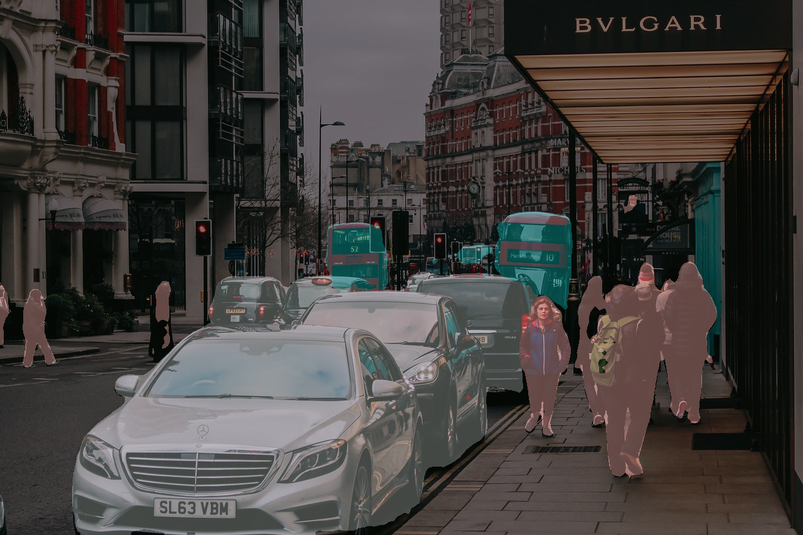

<br>

## Image segmentation : **F**ully **C**onvolutional **N**etwork (**FCN**) Inference

[이미지] 예제코드 [pytorch_tutorials/4.PretrainedNetworks/4.2.PretrainedSegmentation/pretrained_segmentation_fcn_image.py](https://github.com/wooni-github/pytorch_tutorials/blob/main/4.PretrainedNetworks/4.2.PretrainedSegmentation/pretrained_segmentation_fcn_image.py)

[영상] 예제코드 [pytorch_tutorials/4.PretrainedNetworks/4.2.PretrainedSegmentation/pretrained_segmentation_fcn_video.py](https://github.com/wooni-github/pytorch_tutorials/blob/main/4.PretrainedNetworks/4.2.PretrainedSegmentation/pretrained_segmentation_fcn_video.py)

<br>

Image segmentation 기술은 이미지로부터 각 픽셀이 어떤 클래스에 속하는지를 구분하는 네트워크죠.

여러 가지 기술이 존재하지만, 이미지 분류 예제와 마찬가지로 파이토치에서 기본적으로 제공하는 FCN을 사용해보겠습니다.
 
<br>

---
**Inference [Image]**

역시나 큰 틀에서 중요한 부분만 짚고 넘어가겠습니다.


```python
label_map = [
               (0, 0, 0),  # background
               (128, 0, 0), # aeroplane
               (0, 128, 0), # bicycle
               (128, 128, 0), # bird
               (0, 0, 128), # boat
               (128, 0, 128), # bottle
               (0, 128, 128), # bus
               (128, 128, 128), # car
               (64, 0, 0), # cat
               (192, 0, 0), # chair
               (64, 128, 0), # cow
               (192, 128, 0), # dining table
               (64, 0, 128), # dog
               (192, 0, 128), # horse
               (64, 128, 128), # motorbike
               (192, 128, 128), # person
               (0, 64, 0), # potted plant
               (128, 64, 0), # sheep
               (0, 192, 0), # sofa
               (128, 192, 0), # train
               (0, 64, 128) # tv/monitor
]
```

FCN에서 사용한 데이터셋은 `PASCAL-VOC` 데이터셋입니다.

`PASCAL-VOC` 데이터셋은 이미지에서 픽셀별 총 `21개` 클래스를 구분해니다.

`utils.py`에 있는 `label_map`에 각 클래스 정보와, 추론 이후 가시화를 위한 색상 정보가 담겨있습니다.


<br>

```python
def get_segment_labels(image, model, DEVICE):
    transform = transforms.Compose([
        transforms.ToTensor(),
        transforms.Normalize(mean=[0.485, 0.456, 0.406],
                             std=[0.229, 0.224, 0.225])
    ])
    image = transform(image).to(DEVICE).unsqueeze(0)
    outputs = model(image)
    return outputs
```

이미지 분류에 사용하였던 네트워크들은 `ImageNet` 이라는 데이터셋에 대해서 학습을 수행하였는데, `FCN`에서는 `PASCAL-VOC`데이터셋을 사용했다고 말씀드렸죠.

그런데도 `transform`은 동일한 형태로 사용이 되네요.

이미지 분류와 정확하게 동일한 형태로 추론을 실시합니다. 다만, 분류의 결과는 클래스에 속할 확률을 나타내는 벡터 하나였다면, 

세그먼테이션의 결과는 각 픽셀별로 벡터가 나오겠죠 (가로 x 세로 x 클래스 수).

<br>


```python
model = torchvision.models.segmentation.fcn_resnet50(pretrained=True)
model.to(DEVICE)
model.eval()

image = Image.open(args.input)

outputs = utils.get_segment_labels(image, model, DEVICE)
outputs = outputs['out'] # output은 클래스에 속하는 확률이 담긴 'out'과 auxilliary loss가 담긴 'aux'로 구성되어 있음.

overlay, segmented = utils.visualize(image, outputs)
``` 

파이토치의 pretrained 모델, `fcn_resnet50`을 사용할텐데, 확인해보니 추론 결과로 클래스에 대한 확률을 담은 벡터 `out`과 loss가 담긴 `aux`를 반환하네요.

가시화를 위한 `out`만 가져옵니다. 
 
 
<br>

```python
def visualize(input, outputs):
    labels = torch.argmax(outputs.squeeze(), dim=0).detach().cpu().numpy()
    segmented_image = np.zeros([len(labels), len(labels[0]), 3]).astype(np.uint8)

    for label_num in range(0, len(label_map)):
        index = labels == label_num
        segmented_image[index] = np.array(label_map)[label_num]

    image = np.array(input)
    image = cv2.cvtColor(image, cv2.COLOR_RGB2BGR)
    segmented_image = cv2.cvtColor(segmented_image, cv2.COLOR_RGB2BGR)
    cv2.addWeighted(segmented_image, 0.5, image, 0.5, 0, image)
    return image, segmented_image
```

세그먼테이션은 가시화도 난관이죠. 클래스에 해당하는 가시화용 색상 정보를 모든 픽셀에 대해 입혀줍니다.

입력 이미지 `input`과 클래스에 속하는 확률을 담은 `outputs`를 입력으로 받아줍니다.

`labels = torch.argmax(outputs.squeeze(), dim=0).detach().cpu().numpy()` 는 gpu로 연산한 네트워크의 결과를 `cpu`에, 이후 `numpy`형으로 반환하도록 하는 구문입니다.

이후 `segmented_image = np.zeros([len(labels), len(labels[0]), 3]).astype(np.uint8)` 구문을 통해 출력 이미지 크기와 동일한 빈 이미지를 생성하고, 

```python
for label_num in range(0, len(label_map)):
    index = labels == label_num
    segmented_image[index] = np.array(label_map)[label_num]
```
 
 에서 라벨에 해당하는 색상 정보를 픽셀별로 입혀줍니다.
 

|Input|Segmentation result|Visualize|
|---|---|---| 
||||

<br>

---

<br>

**Inference [Video]**


영상에 대한 추론도 사실상 다를 게 없습니다. 이정도 예제를 구현하시는 분이라면 opencv의 영상에 대해선 제가 다룰 이유가 없을 것 같아 설명은 생략하겠습니다.

다만 한 가지 짚고 넘어간다면, 

`frame = cv2.resize(frame, (640, 360))`

으로 영상의 크기를 줄여 네트워크의 입력으로 사용하였다는 점 이겠네요. 원본 영상 그대로 (`FHD, 1920 x 1080`) 사용하여도 되나, 추론 속도가 매우 느려지기에 사이즈를 조절해서 사용합니다.


또한 공부를 제대로 하셨다면 당연한 내용인데요, 이미지는 `[1280 x 853]` 크기인데 영상을 추론할 때는 `[1920 x 1080]` 이나 `[640 x 360]`사이즈 넣어도 돼?

라는 의문을 갖을 수 있지만, 이는 `Fully Convolutional Network`의 특징 덕분에 가능한 것이죠.

분류를 위해 고정된 크기의 `Fully Connected Layers`, `FCL`를 사용하던 기존 Classification 네트워크들과 다르게 모든 레이어를 Convolution 으로 바꿔 이미지 크기가 상관 없는 학습/추론이 가능하도록 해 줍니다.


또한, FCN은 semantic segmentaiton이므로, 픽셀이 어느 클래스에 속하는지만을 구분합니다 (ex:사람)

instance segmentation은 픽셀이 몇 번재 객체에 속하는지까지 구분하므로 semantic segmentation과는 다른 결과 및 가시화를 해줘야겠죠 (ex: 사람1, 사람2, ...)

<br>

---

참고로 예제에 사용한 영상은 `Cambridge Landmarks dataset` 의 `Shop Facade` 의 영상입니다. [[Link]](https://www.repository.cam.ac.uk/handle/1810/251336)

이미지 세그먼테이션을 주로 사용하지 않아 가시화로 적당한 데이터셋을 갖고있지 않아 그럴싸한 영상을 가져왔습니다!

Camera localization (Visual localization)을 위한 데이터셋이기에 당연하게도 `PASCAL-VOC`로 학습한 `FCN`의 평가로는 적합하지 않은 데이터셋이니 참고만 해주세요! 