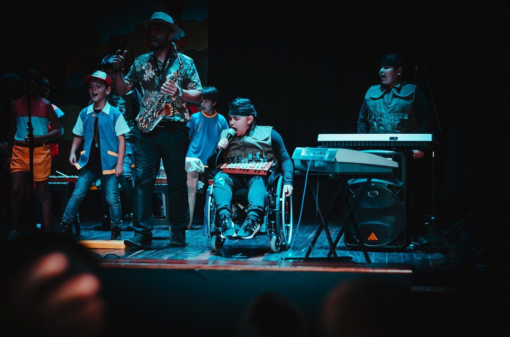
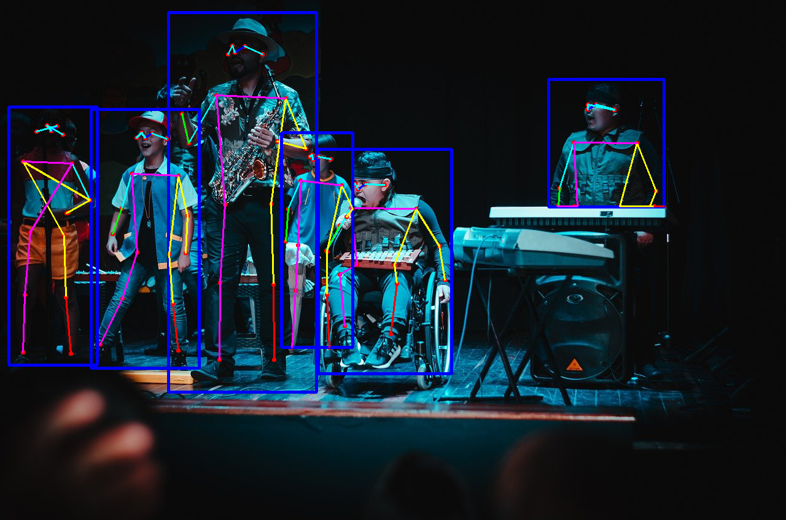

<br>

## **H**uman **P**ose **E**stimation (**HPE**) : keypoint R-CNN Inference

[이미지] 예제코드 [pytorch_tutorials/4.PretrainedNetworks/4.3.PretrainedHPE/pretrained_keypointrcnn_image.py](https://github.com/wooni-github/pytorch_tutorials/blob/main/4.PretrainedNetworks/4.3.PretrainedHPE/pretrained_keypointrcnn_image.py)

[영상] 예제코드 [pytorch_tutorials/4.PretrainedNetworks/4.3.PretrainedHPE/pretrained_keypointrcnn_video.py](https://github.com/wooni-github/pytorch_tutorials/blob/main/4.PretrainedNetworks/4.3.PretrainedHPE/pretrained_keypointrcnn_video.py)

<br>

HPE는 이미지에서 사람의 관절을 좌표를 추정해내는 회귀 알고리즘이죠. 

Single Person HPE는 이미지로부터 1명의 사람의 관절을 추정하는데,

이번 예제에서 다룰 Multi-Person Pose Estiomation에서는 여러 명의 관절을 각각 추정합니다.

설명만 들을면 바로 떠올려야 할 비슷한 알고리즘이 있죠. 바로 이미지 세그먼테이션, 그중에서도 인스턴스 세그먼테이션(Instance segmentation) 입니다.

인스턴스 세그먼테이션은 이미지에서 객체의 클래스를 픽셀별로 구별하는데 Semantic segmentation과 다르게 각 인스턴스마다의 구분 또한 수행해 냅니다.
(Semantic segmentation : 사과, 바나나 // Instance segmentation : 사과1, 사과2, 바나나1, 바나나2)

대표적으로 Mask R-CNN이 있죠. 논문을 읽어보면 Mask R-CNN은 애초에 Multi-person HPE를 고려한 논문이었습니다. 특히나 예제에서는 Keypoint Mask R-CNN으로 호칭하고 있네요.


<br>

---

```python
transform = transforms.Compose([
    transforms.ToTensor()
])
model = torchvision.models.detection.keypointrcnn_resnet50_fpn(pretrained=True, num_keypoints=17)
```

이전 예제들과 다르게, 별도의 `Transform`이 없네요. 하나만 추가할 것은 `num_keypoint=17`로 관절의 갯수를 17개로 설정한 pretrained weigths를 가져온다는 점 입니다.


<br>

```python
outputs = model(transform(image).unsqueeze(0).to(DEVICE))
output_image = utils.draw_keypoints(outputs, image, PIL_image = True)
```

추론 이후에는 별도로 마련한 `draw_keypoints`함수를 이용한 가시화를 수행합니다. 보다 효과적인 가시화를 위해 최종 결과를 OpenCV로 출력합니다.

<br>

```python

edges = [
    (0, 1), (0, 2), (2, 4), (1, 3), (6, 8), (8, 10),
    (5, 7), (7, 9), (5, 11), (11, 13), (13, 15), (6, 12),
    (12, 14), (14, 16), (5, 6)
]
```

`utils.py`에는 관절의 연결 관계를 그래프로 나타내는 `edges`와 이미지에 관절을 그려 반환하는 `draw_keypoints`함수가 존재합니다.

<br>

```python
def draw_keypoints(outputs, image, PIL_image = False):

    image = np.array(image, dtype=np.float32)
    if PIL_image:
        image = cv2.cvtColor(image, cv2.COLOR_RGB2BGR)
    image = image / 255.
```

예제에서는 이미지를 추론할 때는 `PIL`로 로드하였고, 영상을 추론할 때는 `OpenCV`를 이용하였으므로, 이를 구분할 수 있도록 코드를 구성합니다.

<br>

```python
# outputs : boxes, labels, scores, keypoints, keypoints_scores
for i in range(len(outputs[0]['keypoints'])):
    keypoints = outputs[0]['keypoints'][i].cpu().detach().numpy()

    if outputs[0]['scores'][i] > 0.9:
        keypoints = keypoints[:, :].reshape(-1, 3)
        for p in range(keypoints.shape[0]):
            cv2.circle(image, (int(keypoints[p, 0]), int(keypoints[p, 1])), 3, (0, 0, 255), thickness=-1, lineType=cv2.FILLED)

        boxes = outputs[0]['boxes'][i].cpu().detach().numpy()
        x1, y1, x2, y2 = boxes

        cv2.rectangle(image, (int(x1), int(y1)), (int(x2), int(y2)), (255, 0, 0), 3)

        for ie, e in enumerate(edges):
            rgb = matplotlib.colors.hsv_to_rgb([
                ie/float(len(edges)), 1.0, 1.0
            ])
            rgb = rgb*255
            cv2.line(image, (int(keypoints[e, 0][0]), int(keypoints[e, 1][0])),
                    (int(keypoints[e, 0][1]), int(keypoints[e, 1][1])),
                    tuple(rgb), 2, lineType=cv2.LINE_AA)
    else:
        continue
```

가시화 하는 부분은 몇 가지를 주의하면 간단합니다.

우선, 네트워크의 추론 결과는 `boxes, labels, scores, kepoints, keypoints_scores`로 구성됩니다.

`HPE`에서 관심있는 내용은 주로 `keypoints`입니다. 추론한 관절의 위치를 기록한 데이터죠.

그리고 `keypoints_scores`는 추정한 `keypoints`를 어느 정도로 신뢰할 수 있는지를 나타냅니다. 수치가 낮을수록 잘 못 추정된 관절이라는 이미입니다.

`boxes`는 추정한 관절의 `bounding box`를 나타냅니다. 

예제에서는 `keypoints_scores`가 충분히 높은 `keypoints`들 및 이에 해당하는 `boxes`를 가시화 하도록 하였습니다.

<br>

**Image inference**

|Input|HPE result|
|---|---|
|||

**Video inference**

 