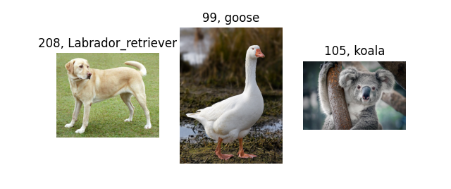

 

# Pretrained networks

파이토치에서 제공하는 다양한 네트워크의 pretrained weights를 이용한 예제입니다.

## [Image classification : ImageNet dataset Inference](https://github.com/wooni-github/pytorch_tutorials/blob/main/4.PretrainedNetworks/4.1.PretrainedClassification/4.1.PretrainedClassification.md)

예제코드 [pytorch_tutorials/4.PretrainedNetworks/4.1.PretrainedClassification/pretrained_classification.py](https://github.com/wooni-github/pytorch_tutorials/blob/main/4.PretrainedNetworks/4.1.PretrainedClassification/pretrained_classification.py)

pretrained 네트워크를 이용하여 ImageNet 데이터셋에 대한 이미지 분류를 수행하는 예제입니다.

## [Image segmentation : **F**ully **C**onvolutional **N**etwork (**FCN**) Inference](h)

예제코드 [pytorch_tutorials/3.SimpleExamples/3.1.Gradient/Gradient.py](h)

## [**H**uman **P**ose **E**stimation (**HPE**) : keypoint **F**ully **C**onvolutional **N**etwork (**FCN**) Inference](h)

예제코드 [pytorch_tutorials/3.SimpleExamples/3.1.Gradient/Gradient.py](h)

