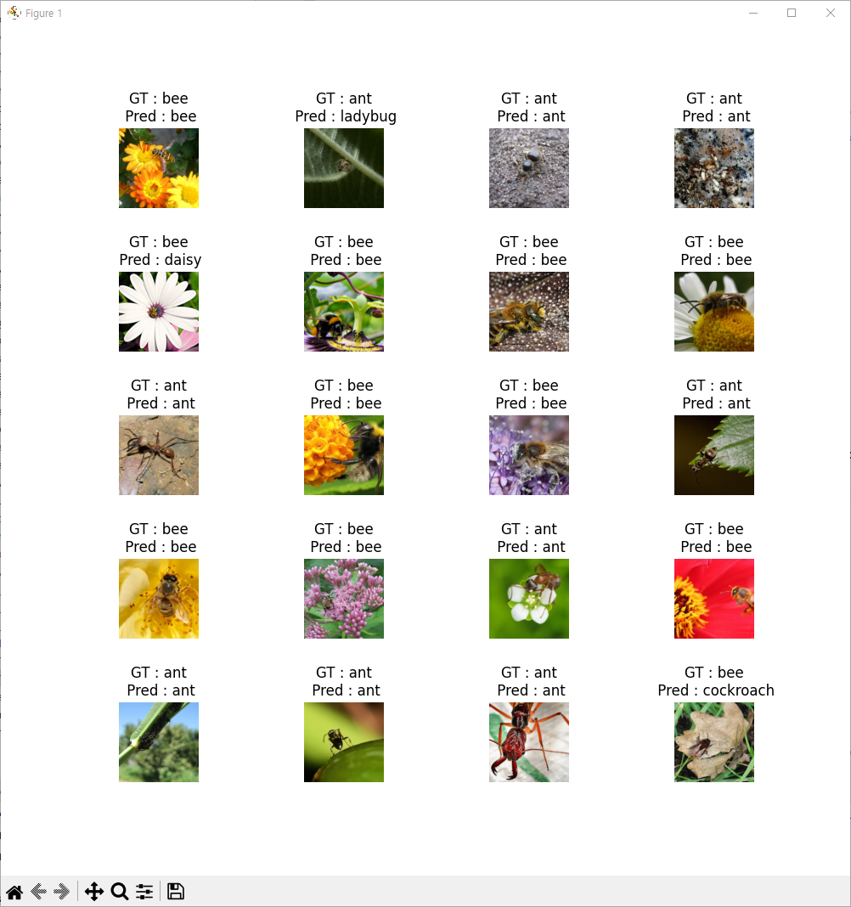

<br>

# Transfer learning & Fine tuning

[Training] 예제코드 [pytorch_tutorials/5.TransferLearningFineTuing/TL_FT_Train.py](https://github.com/wooni-github/pytorch_tutorials/blob/main/5.TransferLearningFineTuning/TL_FT_Train.py)

[Inference] 예제코드 [pytorch_tutorials/5.TransferLearningFineTuing/TL_FT_Test.py](https://github.com/wooni-github/pytorch_tutorials/blob/main/5.TransferLearningFineTuning/TL_FT_Test.py)

앞선 예제들을 통해서 컴퓨터 비전의 다양한 네트워크들의 구조 및 학습이 완료된 weights를 가져와 테스트를 수행해 봤습니다.

이번에는 본격적으로 이들을 활용하여 자신만의 데이터셋에 대해 최적화 하는 전이학습 (Transfer learning)과 파인튜닝(Fine tuning)을 수행해 보겠습니다.

<br>

---
# Definition

서로 다르게 정의하고 있는 분들도 계시던데, 현재 제가 갖고있는 지식으로는 아래와 같이 정의합니다.

* 전이학습 (Transfer learing) : 학습된 신경망의 일부 기능을 가져오는 것.
* 파인튜닝 (Fine tuning) : 전이학습으로 가져온 기능을 자신의 데이터셋에 맞게 최적화하도록 변형하는 것.

이분의 설명이 제가 이해하고 있는 것과 비슷하네요! [[Link]](https://inhovation97.tistory.com/31)
 
파이토치에서 제공하는 `pretrained models`의 `model = models.resnet50(pretrained=True)`를 수행하면 `resnet50`의 **네트워크 구조를 가져오면서, 사전에 저자가 ImageNet 데이터셋에 학습해둔 1000개의 클래스를 구분할 수 있는
네트워크의 가중치를 함께 로드**하게 되죠. 이 행위가 **전이학습** 입니다.

사실 이렇게 구조와 가중치를 가져오는 것 만으로 활용하는 분은 이 페이지를 보실 것 같지 않고, 여기서 자신만의 데이터에 학습해서 최적화를 시도하는 경우가 많으실 것으로 예상됩니다.

이때 가중치를 자신의 데이터셋에 맞게 학습하기 위해 네트워크의 구조를 일부 변경하게 되고 (대다수의 경우), 사전에 로드한 가중치를 어느 부분에 대해서 추가적으로 학습할 것인지 정의합니다.

이 부분이 **나의 데이터셋에 맞게 네트워크의 구조와 가중치를 변경하는, 나 자신만의 학습 데이터에 최적화**하는 **파인튜닝**이 되겠죠.

<br>

Image classification에서는 크게 네트워크 구조가 

* 이미지의 특징을 뽑아내는 Feature extractor (Convolutional Neural Network가 존재하는 영역)
* 이미지를 분류하는데 사용되는 Classifier (Fully Connected Layer 가 존재하는 영역)

로 분할됩니다.

보통 Feature extractor 부분의 가중치는 로드하고,

기존 backbone network 의 Classifier 가 존재하는 부분의 네트워크 구조를 변경하여 재학습합니다. 

예제에서 다루는 코드는 ImageNet 데이터셋에 학습된 `resnet`의 1000개의 클래스로 구분하도록 하는 `FCL`을 2개의 클래스로 구분할 수 있도록 변경하여 학습합니다.

 
 <br>

**Training**

우선, 이번 예제에서 사용할 `ants and bees` 데이터셋을 다운로드 해 줍니다 [[Link]](https://download.pytorch.org/tutorial/hymenoptera_data.zip)

기본적으로는 `pytorch_tutorials/5.TransferLearningFineTuning/` 폴더에 압축을 해제하면 코드가 동작합니다. (물론 arguments로 경로 지정하셔도 됩니다)

<br>


`ants and bees` 데이터셋은 `ants`와 `bees` 두 클래스로 구성된 이미지 분류 데이터셋입니다.

한 가지 체크할 것은, ImageNet 데이터셋은 `ants`가 아닌 `ant`, `bees`가 아닌 `bee`가 클래스 명이라는 것을 참고하시면 됩니다.


<br>

```python
image_datasets = datasets.ImageFolder(args.input_folder, transform_train)
```

코드를 위에서부터 주요 부분만 살펴보면, 다른 예제에서 한번 설명한 적이 있는 `dataloader` 의 `transform` 부분입니다.


<br> 
 
```python
transform_train = transforms.Compose([
    transforms.Resize(256),
    transforms.CenterCrop(224),
    transforms.RandomHorizontalFlip(),
    transforms.ToTensor(),
    transforms.Normalize(mean=[0.485, 0.456, 0.406], std=[0.229, 0.224, 0.225])
])

transform_valid = transforms.Compose([
    transforms.Resize(256),
    transforms.CenterCrop(224),
    transforms.ToTensor(),
    transforms.Normalize(mean=[0.485, 0.456, 0.406], std=[0.229, 0.224, 0.225])
])
```

ImageNet에 사용된 데이터셋은 이미지를 `Resize (256) -> Crop (224) -> Tensor -> Normalize` 하여 사용합니다.

다만 학습시에는 `Crop`을 랜덤하게 하거나, 상하좌우 등을 반전시킨 `Flip`등을 통해 Data augmentation을 수행합니다.

예제 코드에서는 이를 위해 `transform`을 학습시, 추론시 사용하도록 두개를 구성하였습니다.


<br>

학습을 수행하는 과정은 이미 다른 예제에서 봤던 것과 동일하기에 설명은 생략하겠습니다.

중요하게 볼 것은 네트워크의 구조 부분입니다.

```python
def model(fine_tuning = True):
    model = models.resnet50(pretrained=True)

    if not fine_tuning:
        return model

    model.fc = nn.Linear(model.fc.in_features, 2)
    return model
```

우선은 `models.resnet50(pretrained_True)`로 사전에 ImageNet 데이터셋에 대해 학습을 수행한 네트워크 구조와 가중치를 로드합니다 (즉, 전이학습을 수행한 것입니다).

Classifier의 마지막 부분을 살펴보면 `[2048 - 1000(클래스 수)]` 를 연결하는 완전연결층(FCL)이 존재합니다. 

만약 여기서 `ants and bees` 데이터셋에 대한 최적화 (파인 튜닝)을 수행하려고 한다면, 이 완전연결층을 `[2048 - 2(클래스 수)]`로 바꿔줘야 합니다.

그래야 굳이 필요 없는 1000개의 클래스에 대한 예측이 아닌 2개의 클래스에 대한 예측을 수행할 수 있기 때문이죠.


```
ResNet(
  (conv1): Conv2d(3, 64, kernel_size=(7, 7), stride=(2, 2), padding=(3, 3), bias=False)
  (bn1): BatchNorm2d(64, eps=1e-05, momentum=0.1, affine=True, track_running_stats=True)
  (relu): ReLU(inplace=True)
  (maxpool): MaxPool2d(kernel_size=3, stride=2, padding=1, dilation=1, ceil_mode=False)
  (layer1): Sequential(
    (0): Bottleneck(
      (conv1): Conv2d(64, 64, kernel_size=(1, 1), stride=(1, 1), bias=False)
      (bn1): BatchNorm2d(64, eps=1e-05, momentum=0.1, affine=True, track_running_stats=True)

  
  ...
  
    (avgpool): AdaptiveAvgPool2d(output_size=(1, 1))
  (fc): Linear(in_features=2048, out_features=1000, bias=True)  
```

파이토치의 공식 문서를 참조해도 되고, 간단하게 `print(model)`을 수행하면 네트워크 구조가 출력됩니다.

기존 `resnet50`의 경우 `avgpool`로 뽑아낸 피쳐맵을 `fcl`을 통해 1000개의 클래스에 연결해줬네요. 이 때의 레이어의 이름을 `fc`로 정의하였습니다.

파인튜닝을 수행하려면 이 부분을 `model.fc = nn.Linear(model.fc.in_features, 2)` 으로 2개의 클래스를 분류할 수 있도록만 해주면 됩니다.


<br>

---
**Inference**

추론시에도 약간의 주의만 해주면 됩니다.

앞서 설명한 대로 `transform`을 변경하고 `image_datasets = datasets.ImageFolder(args.input_folder, transform_valid)`

```python
with open('imagenet_classes.txt') as f:
    classes_imagenet = [line.strip() for line in f.readlines()]
classes_imagenet = classes_imagenet[4:]  # .txt파일의 최초 4줄은 의미 없음        
```

클래스 이름이 담긴 파일을 로드합니다. 앞선 예제 [[Link]](https://github.com/wooni-github/pytorch_tutorials/blob/main/4.PretrainedNetworks/4.1.PretrainedClassification/README.md) 와 동일하여 설명은 생략합니다.


```python
data, target = data.to(DEVICE), target.to(DEVICE)  # Data -> Device
output = model(data)  # Input data -> Network(Input) -> Output 획득

pred = (torch.max(output, 1)[1]).item()

if args.fine_tuning :
    if classes[target] != classes[pred]:
        correct -= 1
else:
    # classes는 폴더명이(클래스명) 'ants', 'bees' 이지만,
    # ImageNet dataset은 클래스명이 'ant', 'bee' 임

    if classes[target][:-1] != classes_imagenet[pred].split()[1]:
        correct -= 1
```

실제 추론하는 부분 또한 이전 예제들과 큰 차이가 없습니다.

다만 파인튜닝을 수행했을 때는 클래스명이 `datasets.ImageFolder`로 로드한 폴더명 `ants`와 `bees` 지만

수행하지 않았을 때는 ImageNet에서 분류한 데이터셋의 클래스명이 `dataloader`에 `ant`, `bee`로 설정되어 있기에 이부분만 주의합니다.

추론해보면 아래와 같은 결과가 나타납니다.

|`pretrained = True` w\o Fine tuning(1000 class에 대한 확률 예측)|`pretrained = True` w/ Fine tuning (2 class에 대한 확률 예측)|`pretrained = False` w/ Fine tuining (2 class에 대한 확률 예측)|
|:---:|:---:|:---:|
||
86.928%|95.425%|68.627%|

최적화를 하기 위해 `lr`을 변경하거나 `batch_size`나 기타 어떤 것을 건드리지 않고 그냥 코드 몇 줄 복사 붙여넣기 한 것 만으로도 제 컴퓨터 기준 1분정도만 학습을 수해앴는데도 10%가량의 성능 향상이 나타나네요.

만약 `pretrained weights`를 로드하지 않고 완전한 초기값으로부터 2개의 클래스에 대한 학습을 수행하면 68%라는 저조한 수치가 나타납니다. 클래스가 고작 2개라서 학습을 안해도 기대치가 50%라는걸 감안하면 대단히 낮은 수치죠. 물론 학습을 오래 수행하면 수치는 크게 상승하겠지만, 같은 `epoch`로 학습할 때, 가중치의 초기값이 얼마나 중요한지를 이번 예제, `Fine tuning`을 통해 알 수 있었습니다.
