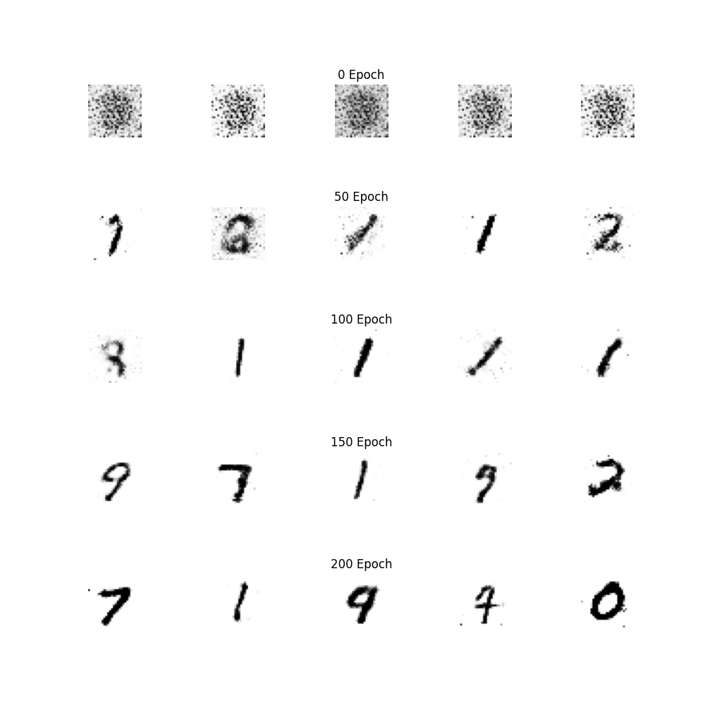
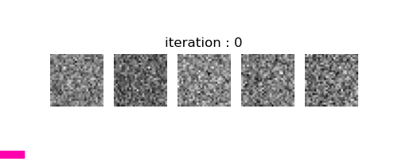

<br>

## GAN : MNIST MLP

- [Training 예제](MNIST_MLP_GAN_TRAIN.py)

- [Inference 예제](MNIST_MLP_GAN_TEST.py)

<br>

MNIST 데이터셋과 MLP에 대해서는 앞서 이미지 분류에서 다룬 예제 [[Link]](../../3.SimpleExamples/3.3.MNIST_MLP/) 를 참고해주세요.

GAN에 대한 상세 내용도 다루지 않습니다. 코드를 구현하는데 필요한 필수적인 요소만 짚고 가겠습니다.

<br>

---
**NETWORK**

우선, `MNIST_MLP_GAN_NETWORK.py`를 살펴보겠습니다.

`GAN`은 두 개의 모델이 서로를 경쟁 관계로 생각하며 학습을 진행해 간다는 것은, 이 예제를 보시는 분들이라면 다들 알고 계실 듯 합니다.

구별자인 `Discriminator = D`는, `진짜 이미지`는 `진짜 이미지`로, `가짜 이미지`는 `가짜 이미지`로 구분하는 것을 학습 목표로 삼고,

생성자인 `Generator = G`는 `가짜 이미지`를 `진짜 이미지`로 `구별자`가 판단하도록 하는 `진짜같은 이미지`를 생성하는 것이 목표입니다.

생성자는 `noise vector`로 이루어진 여러 개의 노이즈 값으로부터 이미지를 생성하는데, 이를 `latent vector`라 합니다.

<br>

**Discriminator**

```python
class Discriminator(nn.Module):
    def __init__(self, image_size=784, hidden_size=256, latent_size=100):
        super(Discriminator, self).__init__()
        self.hidden_size = hidden_size
        self.image_size = image_size
        self.latent_size = latent_size

        self.leaky_relu = nn.LeakyReLU(0.2)
        self.linear1 = nn.Linear(self.image_size, self.hidden_size)
        self.linear2 = nn.Linear(self.hidden_size, self.hidden_size)
        self.linear3 = nn.Linear(self.hidden_size, 1)
        self.sigmoid = nn.Sigmoid()

    def forward(self, x):
        x = self.leaky_relu(self.linear1(x))
        x = self.leaky_relu(self.linear2(x))
        x = self.sigmoid(self.linear3(x))
        return x
```  

`D`의 구조를 보면, MNIST 데이터셋의 이미지 `[W 28 x H 28 x C 1]`의 흑백 이미지를 1D Vector로 펴준 `[784]` 크기를 입력으로 받습니다 (`MLP` 이기 때문이죠).

몇 개의 `FCL (Fully Connected Layers)`을 통과하고, 최종적으로 `784` 크기로 펴진 MNIST 이미지가 진짜/거짓인가 를 구별하는 1개의 값을 반환합니다.

<br>

**Generator**

```python
class Generator(nn.Module):
    def __init__(self, image_size=784, hidden_size=256, latent_size=100):
        super(Generator, self).__init__()
        self.image_size = image_size
        self.hidden_size = hidden_size
        self.latent_size = latent_size

        self.relu = nn.ReLU(0.2)
        self.linear1 = nn.Linear(self.latent_size, self.hidden_size)
        self.linear2 = nn.Linear(self.hidden_size, self.hidden_size)
        self.linear3 = nn.Linear(self.hidden_size, self.image_size)
        self.Tanh = nn.Tanh()

    def forward(self, x):
        x = self.relu(self.linear1(x))
        x = self.relu(self.linear2(x))
        x = self.Tanh(self.linear3(x))
        return x
```

`G`는 앞서 말씀드린 대로, `latent vector`로 표현되는 노이즈를 입력으로 받아 `진짜 같은 이미지`를 생성해야겠죠. 

여기서의 출력값은 MNIST 데이터셋의 이미지와 같은 `[784]` 크기의 1D Vector 입니다.

나중에 이를 `[W 28 x H 28 x C 1]` 로 바꿔주면 이미지가 되겠죠.

코드상으로는, `latent vector`를 입력받아 `MLP`를 거친 후, `[784]` 크기의 벡터를 반환합니다.

<br>

--- 
**Training**

`MNIST_MLP_GAN_Train.py`의 학습 부분도 MNIST 데이터셋을 `MLP`로 분류하는 예제와 비슷하지만, 약간의 차이가 있습니다.

논문으로 보면 엄청 어려워 보이지만, 코드로 보면 간단합니다.

<br>

```python
D = Discriminator().to(DEVICE)
G = Generator().to(DEVICE)

criterion = nn.BCELoss() # True vs False만 구분하면 되므로 BCELoss 사용
d_optimizer = torch.optim.Adam(D.parameters(), lr=0.0002)
g_optimizer = torch.optim.Adam(G.parameters(), lr=0.0002)
```

우선, `G`와 `D` 네트워크 구조를 모두 로드합니다.

손실함수로는 `BCELoss`를 사용합니다. (참/거짓 만 구분)

<br>

```python
real_images = real_images.reshape(BATCH_SIZE, -1).to(DEVICE)
# CNN이 아닌 FCL만을 사용하였으므로 이미지를 1D Vector로 펴줌 [1 x 784]
```

여러 차례 설명한 대로, MNIST 데이터셋 이미지를 불러와 1D Vector로 펴줍니다.

<br>

```python
real_labels = torch.ones(BATCH_SIZE, 1).to(DEVICE)
fake_labels = torch.zeros(BATCH_SIZE, 1).to(DEVICE)
# Batch 갯수만큼 real label : 1, fake label : 0으로 설정
```

이후 배치 수만큼 참(1)으로 표기된 `real_labels`, 거짓(0)으로 표기된 `fake_labels`를 준비합니다.


<br>

```python
# Discriminator 학습
real_score = D(real_images)
d_loss_real = criterion(real_score, real_labels)  # real 이미지를 D에 넣었을 때는 real로 판별해야함(1)
```

`GAN` 자체는 두 개의 네트워크가 서로 경쟁하면서 학습한다고 설명이 되지만, 코드상으로는 동시에 경쟁하진 않습니다.

`D`를 먼저 몇 번 학습하고 `G`를 학습하거나, 반대의 경우로 학습을 수행합니다.

예제에서는 먼저 `D`를 학습합니다. `D`에 `real_images`를 넣었을 때 `D`는 당연히 `진짜 이미지`인 `real_labels`로 분류해야겠죠.

<br>

```python
z = torch.randn(BATCH_SIZE, latent_size).to(DEVICE)
fake_images = G(z)  # latent vector z를 Generator에 넣어 fake 이미지 생성
fake_score = D(fake_images)
d_loss_fake = criterion(fake_score, fake_labels)  # 이 때 D(G(z))는 fake 이미지로 판별해야 함 (0)

d_loss = d_loss_real + d_loss_fake  # D는 E[logD(x)] + E[log(1-D(G(z))]를 모두 학습함
# 즉, D는 real 이미지를 real로, fake 이미지를 fake로 구분할 수 있도록 학습이 진행됨

d_optimizer.zero_grad()
g_optimizer.zero_grad()

d_loss.backward()
d_optimizer.step()
```
 
다만, `D`는 `진짜`를 `진짜`로만 판별하는게 아닌, `가짜` 또한 `가짜`로 판별해야합니다. 

이를 위해 `latent vector z`로부터 `fake_images = G(z)`를 이용해 `가짜 이미지`를 생성해줍니다.

`D`는 `fake_images`를 `가짜 이미지`인 `fake_labels`로 구분해내야겠죠. 

결과적으로 `d_loss_real + d_loss_fake`를 학습합니다.
  
<br>

```python
# Generator 학습
z = torch.randn(BATCH_SIZE, latent_size).to(DEVICE)
fake_images = G(z)
fake_score2 = D(fake_images)

g_loss = criterion(fake_score2, real_labels)
# D는 E[logD(x)] + E[log(1-D(G(z))]를 모두 학습함
# G는 G에 관한 term이 없는 좌측을 생략한 E[log(1-D(G(z))]를 학습함
# 즉, z로부터 G로 생성한 fake 이미지를 real 이미지로 분류하도록 학습

d_optimizer.zero_grad()
g_optimizer.zero_grad()

g_loss.backward()
g_optimizer.step()
```

이후엔 `G`를 학습해줍니다.

동일하게 `latent vector z`로부터 `G(z)`를 통해 `가짜 이미지`를 생성합니다.

코드상으로 `G`만으로는 학습을 수행할 수는 없습니다. 하지만 의미를 해석해 보면 간단합니다.

`G`는 `z`로부터 `가짜 이미지`를 생성하는데, 이를 `D`가 `진짜 이미지`라고 구분하면, 결과적으로 `G`는 `진짜같은 가짜 이미지`를 생성한 것입니다.

코드상으로 정확하게 이렇게 구현이 되어있죠. `G(z)`로 만든 `fake_images`를 `D`가 `real_labels`로 구분하도록 되어있습니다. 

<br>

--- 
**Inference**

```python
z = torch.randn(1, latent_size).to(device) # latent vector로부터
fake_images = G(z) # G를 통해 이미지 생성

fake_images = fake_images.reshape(fake_images.size(0), 1, 28, 28)
subplot = fig.add_subplot(5, 5, j + 1 + i*5, )
subplot.imshow(denorm(fake_images).cpu().detach().numpy().reshape((28, 28)), cmap=plt.cm.gray_r)
```

추론시에는 일반적으로 `D`는 필요하지 않고, `G`만 필요합니다. 최종적으로 `진짜 같은 가짜 이미지`만 있으면 되니까요.

예제에서는 Epoch별 결과를 보여주기 위해 몇 개의 `G`를 저장하였습니다. 

진짜 같은 이미지를 생성하는데는 앞선 `G`에 `latent vector z`를 넣어주기만 하면 됩니다.

물론 코드상으로는 `[W 28 x H 28 x C 1]` 형태로 `resize`해주고, 학습시 수행한 `normalize`를 역으로 수행하는 `denormalize`를 해줘야 눈으로 볼 수 있는 이미지 형태로 전환됩니다.

<br>



학습이 진행될 수록 자연수러운 숫자의 이미지가 생성되네요.

이후 다른 예제에서 다루겠지만, 첨부한 결과 이미지의 각 열이 같은 클래스(숫자)인가? 라고 생각할 수 있지만 전혀 아닙니다.

각 Epoch별로 5개의 이미지를 생성하였는데, 이는 랜덤한 `latent vector`로부터 생성된 것이고, 숫자가 우연히 같은 열에서 비슷하게 나왔을 뿐입니다.

