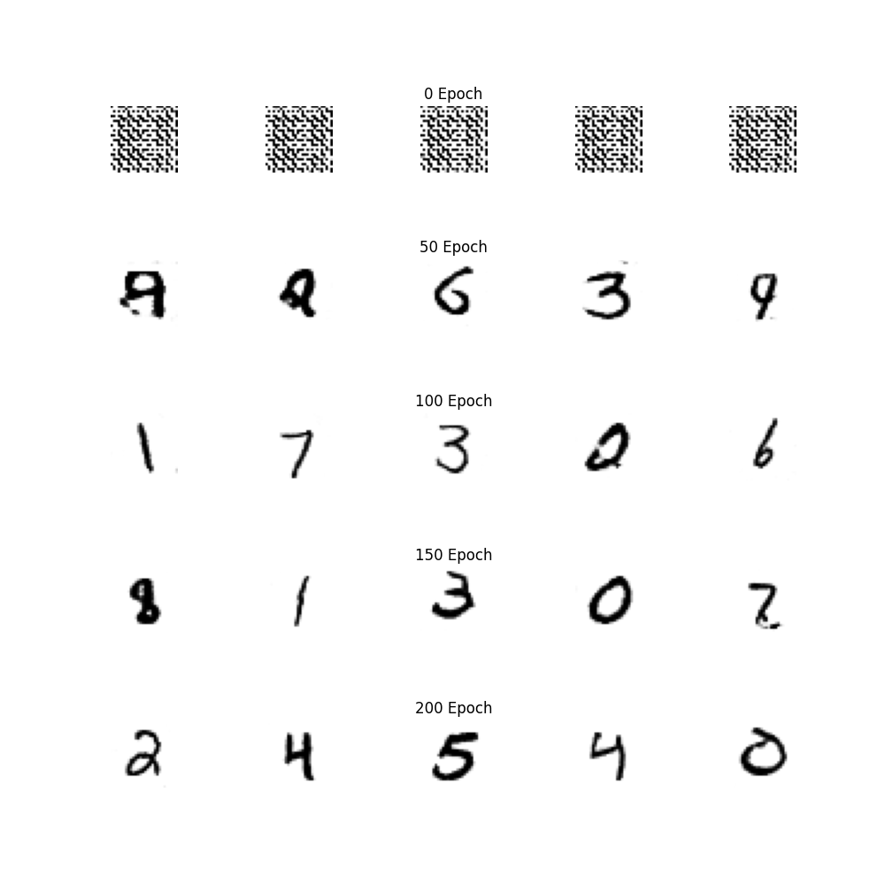

<br>

## GAN : MNIST CGAN (Deep Convolutional GAN)

- [Training 예제](MNIST_DCGAN_TRAIN.py)

- [Inference 예제](MNIST_DCGAN_TEST.py)

<br>

이번에는 앞서 다룬 `MLP`를 이용한 MNIST 데이터셋의 GAN [[Link]](../6.1.MNIST_MLP_GAN/README.md)의 네트워크 구조를 `MLP` 대신 `CNN`으로 변경해보겠습니다.

<br>

---
**NETWORK**

우선, `MNIST_DCGAN_NETWORK.py`를 살펴보겠습니다.

<br>

**Discriminator**

```python
class C_Discriminator(nn.Module):
    def __init__(self):
        super(C_Discriminator, self).__init__()
        self.main = nn.Sequential(
            nn.Conv2d(nc, ndf, 4, 2, 1, bias=False),
            nn.LeakyReLU(0.2, inplace=True),

            nn.Conv2d(ndf, ndf * 2, 4, 2, 1, bias=False),
            nn.BatchNorm2d(ndf * 2),
            nn.LeakyReLU(0.2, inplace=True),

            nn.Conv2d(ndf * 2, ndf * 4, 4, 2, 1, bias=False),
            nn.BatchNorm2d(ndf * 4),
            nn.LeakyReLU(0.2, inplace=True),

            nn.Conv2d(ndf * 4, 1, 4, 2, 1, bias=False),
            nn.Sigmoid()
        )

    def forward(self, input):
        return self.main(input).view(-1, 1)

```  

앞서 다양한 예제에서 `MLP`, `CNN` 그리고 `MNIST` 데이터셋을 활용하였기에 이해하는데 큰 문제는 없을 것으로 예상됩니다.

`MLP`의 경우, MNIST 데이터셋의 이미지 `[W 28 x H 28 x C 1]`의 흑백 이미지를 1D Vector로 펴준 `[784]` 크기를 입력으로 받습니다.

`CNN`의 경우 그럴 이유가 없으니 이미지 크기 그대로를 입력으로 받고 `Conv2D`를 통해 feature map을 생성합니다.

마지막에 `.view`로 펴주는 이유는, `Conv`의 결과로 나온 feature map이 `[B x 1 x 1 x 1]` 형태로 나오기에 `[B]` 형태로 바꿔주기 위함입니다.

<br>

**Generator**

```python
class C_Generator(nn.Module):
    def __init__(self):
        super(C_Generator, self).__init__()
        self.main = nn.Sequential(
            nn.ConvTranspose2d(nz, ngf * 8, 4, 1, 0, bias=False),
            nn.BatchNorm2d(ngf * 8),
            nn.ReLU(True),

            nn.ConvTranspose2d(ngf * 8, ngf * 4, 4, 2, 1, bias=False),
            nn.BatchNorm2d(ngf * 4),
            nn.ReLU(True),

            nn.ConvTranspose2d(ngf * 4, ngf * 2, 4, 2, 1, bias=False),
            nn.BatchNorm2d(ngf * 2),
            nn.ReLU(True),

            nn.ConvTranspose2d(ngf * 2, ngf, 4, 2, 1, bias=False),
            nn.BatchNorm2d(ngf),
            nn.ReLU(True),
            nn.ConvTranspose2d(ngf, nc, kernel_size=1, stride=1, padding=2, bias=False),
            nn.Tanh()
        )

    def forward(self, input):
        return self.main(input)
```  

`G`는 `laternt vector` 로부터 `[W 28 x H 28 x C 1]` 크기의 이미지를 생성합니다.

`MLP`의 경우 `[784]`크기의 벡터가 `G`의 출력으로 나와 다시 형태를 변경해 주어야 했지만, `ConvTransopose2d`를 적용하여 그럴 이유가 사라졌습니다.

<br>

--- 
**Training**

네트워크에 들어가는 입력, 출력의 shape만 변경해주면 `MLP` 예제와 거의 동일합니다. 

<br>

```python
# real_images = real_images.reshape(BATCH_SIZE, -1).to(DEVICE) # [6.1.MNIST_MLP_GAN]
real_images = real_images.to(DEVICE) # [b x 1 x 28 x 28]


...

# Discriminator 학습
real_score = D(real_images)
```

`MLP`와 다르게 `MNIST`데이터셋의 이미지를 펴주지 않고 그대로 활용합니다.


<br>

```python
# Generator 학습
z = torch.randn(BATCH_SIZE, latent_size, 1, 1).to(DEVICE)
fake_images = G(z)
fake_score2 = D(fake_images)
```

`G`를 학습하는 경우에도 비슷하게 구성합니다.

동일하게 `latent vector z`로부터 `G(z)`를 통해 `가짜 이미지`를 생성하고, 그대로 `D(G(z))`를 학습합니다.


<br>

--- 
**Inference**

```python
z = torch.randn(1, latent_size, 1, 1).to(DEVICE)
fake_images = G(z) # G를 통해 이미지 생성
subplot.imshow(denorm(fake_images).cpu().detach().numpy().reshape((28, 28)), cmap=plt.cm.gray_r)
# subplot.imshow(denorm(fake_images[0][0]).cpu().detach().numpy(), cmap=plt.cm.gray_r)
```

추론시에도 매우 간단합니다. `G(z)`를 통해 생성된 이미지를 그대로 사용하면 됩니다.

`.reshape(28, 28)`을 해주는 이유는 batch로부터 생성된 출력이 `[B x 1 x W x H]` 형태이기에 `subplot`에 맞게 변환해줄 필요가 있기 때문입니다. 

<br>



마찬가지로 학습이 진행될 때마다 보다 자연스러운 결과가 생성되네요.

`MLP`와 `CNN`의 직접적인 비교는 어렵지만, 훨씬 자연스러운 이미지가 생성된 것 처럼 보입니다. 

