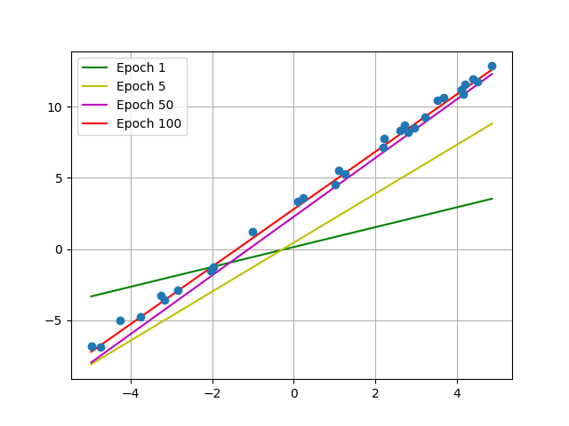
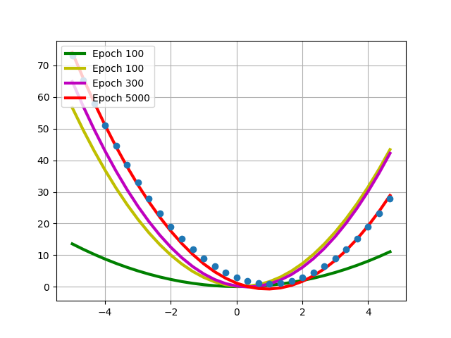
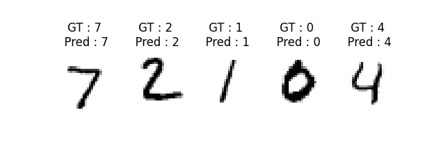

# 파이토치 초보자를 위한 repo입니다.

최종적으로 CNN을 이용한 잘 알려진 네트워크들을 구현하는 것을 목표로 하고 있습니다!

ex) Classification, Detection, Segmentation, Regression, GAN, ...


## 기본적인 개발 환경 구성 (RTX3090 : CUDA, CuDNN, Windows10에서 작업)


```bash
git clone https://github.com/wooni-github/pytorch_tutorials
cd <다운 위치>
conda env create --file environment.yaml
```

혹은 (torch만 각 환경에 맞게 설정)

```bash
conda create -n pytorch_tutorials python=3.8
conda activate pytorch_tutorials
conda install pytorch==1.11.0 torchvision==0.12.0 torchaudio==0.11.0 cudatoolkit=11.3 -c pytorch
pip install matplotlib
pip install torchsummary
```

<br>

**Requirements**

```bash
pytorch
torchvision
torchsummary
numpy
matplotlib
```

## [1. Tensor operations, reshape](https://github.com/wooni-github/pytorch_tutorials/blob/main/1.Tensors/1.Tensors.md)

기본적인 텐서 생성, 변환, 연산(곱, 행렬곱, 합), 접근, 형태 변환 등에 관한 예제입니다.


## [2. DataLoader](https://github.com/wooni-github/pytorch_tutorials/blob/main/2.DataLoader/2.DataLoader.md)

파이토치에서 학습/추론시 배치별 데이터 생성을 위한 `DataLoader`에 관한 예제입니다.


## [3. SimpleExamples](https://github.com/wooni-github/pytorch_tutorials/blob/main/3.SimpleExamples/3.SimpleExamples.md)

본격적인 **SOTA**를 살펴보기 전, 간단한 예제들을 통해 파이토치의 여러가지 기능을 사용해보는 예제입니다.

* Gradient를 이용한 미분값 구하기
* Linear regression $y = ax + b$



* Lienar regression $y = ax^2 + bx + c$



* MNIST image classification : **M**ulti-**L**ayer **P**erceptron (**MLP**) ~ **F**ully **C**onnected **L**ayers (**FCL**)
* MNIST image classification : **C**onvolutional **N**eural **N**etwork (**CNN**)


* MNIST image regression
 
## [4. Pretrained networks]()

파이토치에서 제공하는 다양한 네트워크의 pretrained weights를 이용한 예제입니다.

* Image classification : ResNet Inference
* Image segmentation : **F**ully **C**onvolutional **N**etwork (**F-CN**) Inference
* **H**uman **P**ose **E**stimation (**HPE**) : keypoint **F**ully **C**onvolutional **N**etwork (**FCN**) Inference

## [5. Transfer learning & Fine tuning]()

커스텀 데이터셋에 파이토치의 pretrained network를 이용하여 전이학습 (Transfer learning)과 파인 튜닝 (Fine tuning)을 적용해 이미지 분류 (Image classification)를 수행해보는 예제입니다.

또한, 커스텀 데이터셋을 학습하고 변경된 네트워크를 이용한 분류를 수행하도록 합니다. 

## [6. GAN]()

적대적 생성 신경망 (**G**enerative **A**dversarial **N**etworks)을 이용한 MNIST 데이터 생성 예제입니다.

