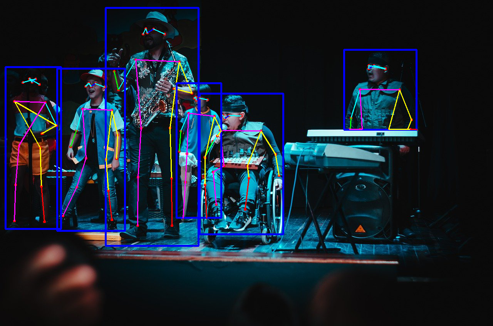

# 파이토치 초보자를 위한 repo입니다.

최종적으로 CNN을 이용한 잘 알려진 네트워크들을 구현하는 것을 목표로 하고 있습니다!

ex) Classification, Detection, Segmentation, Regression, GAN, ...


## 기본적인 개발 환경 구성 (RTX3090 : CUDA, CuDNN, Windows10에서 작업)


```bash
git clone https://github.com/wooni-github/pytorch_tutorials
cd pytorch_tutorials
conda env create --file environment.yaml
```

혹은 (torch만 각 환경에 맞게 설정)

```bash
conda create -n pytorch_tutorials python=3.8
conda activate pytorch_tutorials
conda install pytorch==1.11.0 torchvision==0.12.0 torchaudio==0.11.0 cudatoolkit=11.3 -c pytorch
pip install matplotlib
pip install torchsummary
pip install opencv-python
```

<br>

**Requirements**

```bash
pytorch
torchvision
torchsummary
numpy
matplotlib
opencv
```

## [1. Tensor operations, reshape](1.Tensors/)

기본적인 텐서 생성, 변환, 연산(곱, 행렬곱, 합), 접근, 형태 변환 등에 관한 예제입니다.


## [2. DataLoader](2.DataLoader/)

파이토치에서 학습/추론시 배치별 데이터 생성을 위한 `DataLoader`에 관한 예제입니다.


## [3. SimpleExamples](3.SimpleExamples/)

본격적인 **SOTA**를 살펴보기 전, 간단한 예제들을 통해 파이토치의 여러가지 기능을 사용해보는 예제입니다.

* Gradient를 이용한 미분값 구하기
* Linear regression $y = ax + b$


* Lienar regression $y = ax^2 + bx + c$


* MNIST image classification : **M**ulti-**L**ayer **P**erceptron (`MLP`) ~ **F**ully **C**onnected **L**ayers (`FCL`)
* MNIST image classification : **C**onvolutional **N**eural **N**etwork (`CNN`)


* MNIST image regression

 

## [4. Pretrained networks](4.PretrainedNetworks/)

파이토치에서 제공하는 다양한 네트워크의 pretrained weights를 이용한 예제입니다.

* Image classification : ImageNet dataset Inference
 
 

<br>

* Image segmentation : **F**ully **C**onvolutional **N**etwork (**FCN**) Inference

|Input|Segmentation result|Visualize|
|---|---|---| 
||||

<br>


<br>

* **H**uman **P**ose **E**stimation (**HPE**) : keypoint R-CNN Inference

|Input|HPE result|
|---|---|
|||

<br>


<br>

## [5. Transfer learning & Fine tuning](5.TransferLearningFineTuning/)

커스텀 데이터셋에 파이토치의 pretrained network를 이용하여 전이학습 (Transfer learning)과 파인 튜닝 (Fine tuning)을 적용해 이미지 분류 (Image classification)를 수행해보는 예제입니다.

또한, 커스텀 데이터셋을 학습하고 변경된 네트워크를 이용한 분류를 수행하도록 합니다. 


<br>

## [6. GAN](6.GAN/)

적대적 생성 신경망 (**G**enerative **A**dversarial **N**etworks)을 이용한 MNIST 데이터 생성 예제입니다.


- MNIST GAN
- MNIST DCGAN (Deep Convolutional GAN)
- MNIST CGAN (Conditional GAN)

